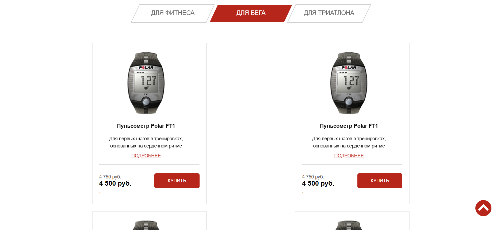

# Pulse (учебный проект)

## Описание проекта
Pulse — это интерактивная страница, на которой пользователи могут выбрать пульсометр с учётом уровня подготовки и оставить данные для обратной связи.

## Функционал:
- Переключение между табами;
- Всплывающие формы с обратной связью;
- User eXperience (UX);
- Адаптивный интерфейс для разных устройств.

## Стек технологий:
- HTML5;
- CSS3:
- Препроцессоры: SCSS
- Методология БЭМ;
- Вёрстка по макету в Figma;
- JavaScript
- Библиотеки:
  - jQuery — это JavaScript-фреймворк фокусирующийся на взаимодействии JavaScript и HTML;
  - PHPMailer - это библиотека для безопасной и простой отправки электронных писем с помощью кода PHP с веб-сервера.
  - Animate.css это кроссбраузерная библиотека для добавления CSS-анимации.
  - Slick Carousel — это плагин для создания адаптивного слайдера;

## Установка и запуск проекта:
```bash
Установить зависимости:

    npm install

Запустить проект:

    npx gulp
```


## Скриншот интерфейса



